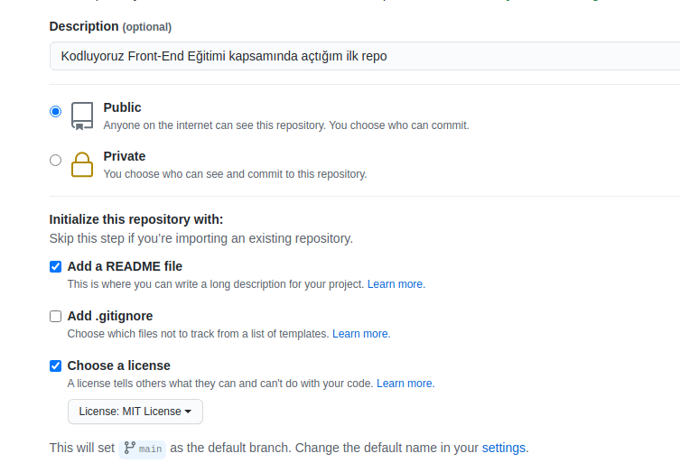

# Kodluyoruz Ilk Repo

Bu repo [Kodluyoruz](https://www.kodluyoruz.org/) Front-End Eğitiminde  oluşturduğumuz ilk repo. İçerisinde bir adet README dosyası, bir adet de index.html barındırıyor



## Installation

Öncelikle projeyi clonelayın
```
git clone https://github.com/YazilimMeraki/kodluyoruzilkrepo
```

## Usage

Projeyi cloneladıktan sonra Visual Studio Code programında açınız.

Linux için:
```
cd kodluyoruzilkrepo
code
```

## Contributing

Pull requestler kabul edilir. Büyük değişikler için,lütfen  önce neyi değiştirmek istediğinizi tartışmak için konu açınız.

## Licance

[MIT](https://choosealicense.com/licenses/mit/)